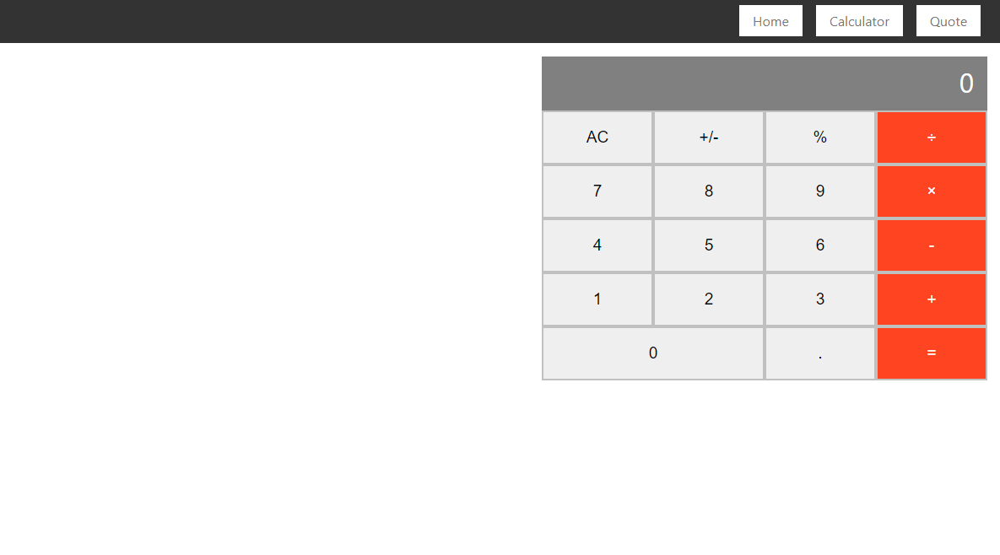

# Calculator

> This is a multiple-page calculator app built with react

## Built With

- Javascript
- React
- babel, css, eslint, stylelint, jest

## Live Demo

[See project](https://damp-lowlands-73562.herokuapp.com/)

## Getting Started

To get a local copy up and running follow these simple example steps.

- Open your terminal
Then run the following command line
- `git clone https://github.com/MahmoudBakr23/my-calculator.git`
Then run the following command line
- `cd my-calculator`
Then install the required npm packages to run the app
- `npm i`
Then run this command line to start the app
- `npm run start`

### Run tests
To run the tests type this command line in the terminal
- `npm run test`

## Authors

👤 **Mahmoud Bakr**

- GitHub: [@githubhandle](https://github.com/MahmoudBakr23)
- LinkedIn: [LinkedIn](https://www.linkedin.com/in/m-bakr/)

## 🤝 Contributing

Contributions, issues, and feature requests are welcome!

Feel free to check the [issues page](https://github.com/MahmoudBakr23/my-calculator/issues).

## Show your support

Give a ⭐️ if you like this project!

## Acknowledgments

- [Microverse](https://www.microverse.org/)

## 📝 License

License free.